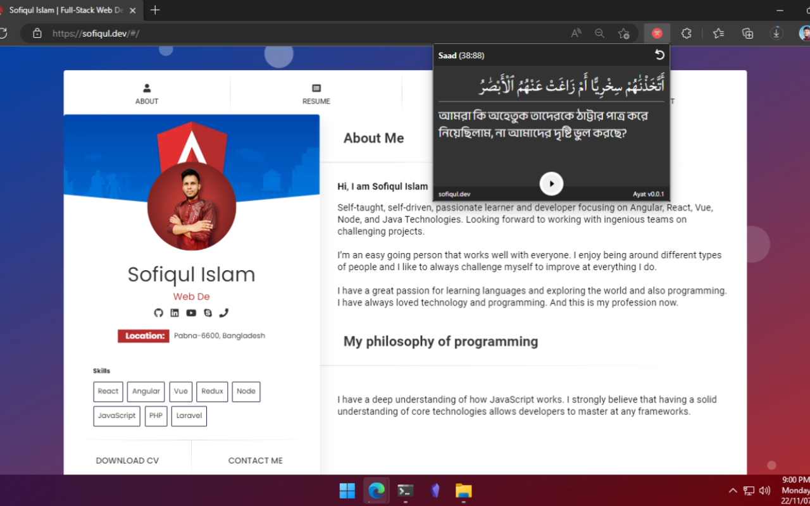

## **Ayat**
### Ayat is a random verse loader from Quran.
-----------------

### **what you can do**
 - [x] Load random ayat of **Quran**
 - [x] Know sura info. *(**Sura Name**, **Sura Number*** and ***verse number**.)*
 - [x] Read the **Arabic** text
 - [x] Read **Bengali** translate of this ayat
 - [x] **Listen** the ayat with **Play/Pause** button
 - [] Can't **Copy** the ayat or translate
 - [] Can't **Share** this ayat to anywhere 
 - [x] **Select** and **copy/share** it as **manually**
---
- [x] You can load random **Ayat of Quran**
- [x] You can **read** by watching Arabic
- [x] You can read the **Bengali Translation** of this verse
- [x] You can **listen** to the verse with **play/pause** button
- [] **Verses** can't be **copied** or **shared**, *but*
- [x] You can **manually** select and copy/share
- [x] Extention theme inherit from browser default theme. **[Light/Dark]**
- [] Can't running it as **background app.** 

### **Promo Video**
[YouTube Link](https://youtu.be/FOOVZpL_Db4)